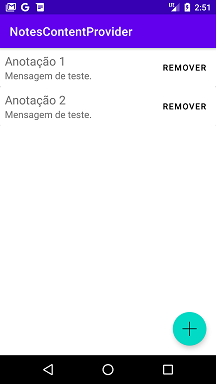
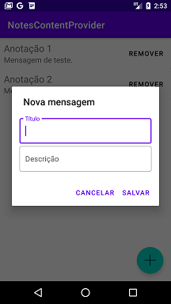
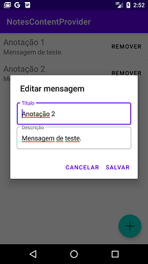

# Notes Content Provider
Projeto desenvolvido no curso "Desenvolvimento integrado de aplicações Android" do Bootcamp everis Kotlin Developer da [Digital Innovation One](https://digitalinnovation.one).

Este aplicativo é um aplicativo de notas. O usuário pode inserir, editar e excluir notas.

O aplicativo de notas usa o conceito de Content Provider para compartilhar informações entre aplicativos.

## Instruções
Faça o clone ou o download do repositório e execute o aplicativo no Android Studio.

## Screenshots

